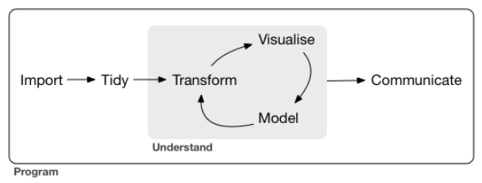
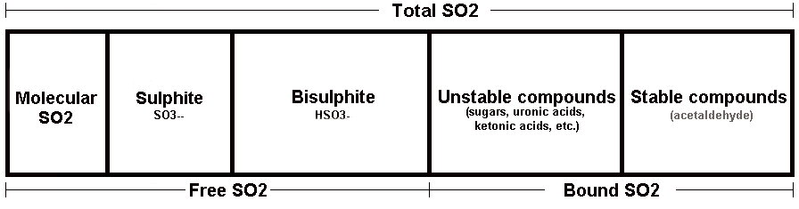

# Análise Exploratória de Dados - Qualidade de Vinhos Tintos
#### por Leonardo Borges
#### Nanodegree Data Science for Business da Udacity


-------


## Introdução

Este documento é a síntese do projeto de Análise Exploratória de Dados (EDA), referente ao programa Nanodegree Data Science for Business da Udacity. Neste trabalho, utilizamos o workflow proposto por Hadley Wickham e Garret Grolemund [1] na exploração de um conjunto de dados de vinhos tintos, buscando entender quais os fatores e as propriedades que determinam a qualidade do vinho, bem como na estruturação deste documento.

```{r wickham_workflow, echo=FALSE, fig.cap="Fig 1. Workflow de Wickham e Grolemund", out.width = '50%', fig.align = 'center'}

# Adiciona uma figura contendo o workflow


```

```{r carrega_packages, echo=FALSE, message=FALSE, warning=FALSE}

# Carrega as bibliotecas utilizadas neste projeto
library("ggplot2")
library("GGally")
library("grid")
library("gridExtra")
library("RColorBrewer")
library("pander")
library("memisc")
library("knitr")

```


-------


## Conjunto de Dados

Este conjunto de dados (dataset) foi obtido por meio do endereço https://bit.ly/2KTzkjX. Podemos notar que ele possui 1599 observações contendo 13 variáveis cada. Uma variável (X) é apenas um contador incremental, sendo outras doze compostos ou propriedades químicas (*fixed.acidity*, *chlorides*, *pH*, etc.) presentes nas amostras e a última (*quality*) é nossa variável de interesse que indica a qualidade do vinho.

A determinação da qualidade no dataset foi obtida pela média da avaliação de pelo menos 3 especialistas. Mesmo sendo realizada por especialistas, o processo de determinação é não objetivo, mas passa por uma subjetividade daqueles que avaliam e atribuem uma nota à bebida, podendo gerar discrepâncias que, para as mesmas condições de entrada obtemos diferentes saídas.

```{r carrega_dados, echo=FALSE}

# Importa o dataset e imprime o dataframe
data <- read.csv('wineQualityReds.csv', encoding = 'UTF-8')
str(data)

```

Observamos que o nosso dataset não possui nenhum dado faltante, indicando a plenitude da coleta realizada.

```{r verifica_NA, echo=FALSE}

# Verifica a existência de dados faltantes
sum(is.na(data))

```

A variável *X* não possui nenhuma informação relevante para o nosso processo de exploração. Além disso, entendemos a qualidade como uma variável categórica, indicando qualitativamente o nível de qualidade do vinho. Desta forma, realizamos algumas transformações em nosso dataframe, removendo a primeira e criando uma nova variável categórica denominada *quality.cat*.

```{r cria_quality_cat, echo=FALSE}

# Remove a variável X, adiciona quality.cat e imprime a nova variável
data <- subset(data, select = -c(X))
data <- transform(data, quality.cat = factor(quality, ordered = TRUE))

str(data$quality.cat)

```

Sumarizando o dataframe, percebemos que praticamente todas as variavéis possuem valores máximos muitas vezes superior ao valor médio ou até mesmo ao limiar do 3º quartil, indicando uma grande variação ou dispersão dos dados. Além disso, embora a variável de qualidade seja uma escala de 0 a 10, não há nenhum registro de vinhos com qualidade 0, 1, 2, 9 e 10, e poucas amostras com qualidade 3 e 8.

```{r sumariza_dados, echo=FALSE, , message=FALSE, warning=FALSE, results='asis'}

# Sumariza o dataframe
pandoc.table(summary(data))

```

Para verificar de forma mais assertiva a dispersão dos dados, de modo que permita a comparabilidade entre as variáveis, calculamos o coeficiente de variação (CV) de todas, exceto de *quality.cat*. Com unidade de medida em porcentagem (%), notamos uma expressiva variação na maioria dos compostos químicos, principalmente do ácido cítrico (*citric.acid*: ~71,9%) e do dióxido de enxofre total (*total.sulfur.dioxide*: ~70,8%). Por outro lado, temos a densidade (*density*) com um CV inferior a 0,2%.

```{r calcula_CV, echo=FALSE, results='asis'}

# Define a função que calcula o coeficiente de variação (CV)
CV <- function(x) 100 * sd(x) / mean(x)

# Aplica a função em todo o dataframe, exceto na variável categórica
CV_data <- apply(subset(data, select = -c(quality.cat)), 2, CV)

# Imprime a tabela com os coef. de variação das variáveis
pandoc.table(CV_data)

```

Segundo Pimentel Gomes [2], um CV superior a 30% pode ser considerado uma dispersão de dados muito alta, caracterizando uma heterogeneidade do grupo amostral. Contudo, como já observado, temos valores máximos nas amostras bem superiores aos valores médios, o que pode indicar a presença de outliers. Como o CV utiliza o desvio padrão para estimar o grau de dispersão, a presença de outliers pode ser significativa na elevação drástica do desvio padrão e consequentemente do CV.


-------


## Entendendo mais sobre Vinhos

Antes de nos lançarmos efetivamente nas análises dos dados, realizamos uma modesta investigação na literatura sobre vinhos e como os compostos químicos no processo de vinificação podem alterar a sua qualidade. Esta etapa é importante, pois nos permite sermos mais assertivos em nossa exploração, otimizando as transformações do dataframe, evitando ou minimizando interpretações equivocadas e correlações espúrias entre as variáveis.


### Processo de Vinificação de Vinhos Tintos

Embora fatores como a cepa da uva, o solo, a temperatura (ou o *Terroir*) possam ter forte influência na qualidade vinho, é no processo de vinificação que ocorre em maior medida a influência humana [3]. Para os vinhos tintos, este processo é constituído de 7 etapas [4], sendo elas: colheita, desengaço e esmagamento (que origina o mosto), fermentação, trasfega, clarificação e estabilização, amadurecimento e engarrafamento.


### Avaliando a Qualidade do Vinho

Segundo um artigo publicado por Carol Teixeira [5], gostar ou não gostar é uma questão pessoal, mas a qualidade pode ser identificada por meio de alguns fatores. Destacamos as principais, as quais podemos correlacionar com os dados fornecidos em nosso dataset.

  - **Desequilíbrio:** Quando um dos elemento se sobressai, tornando o vinho desagradável. Ex.: muito alcoólico, muito ácido ou muito tânico;
  - **Sulfídrico:** Quando exala odor forte característico do enxofre;
  - **Oxidação:** Caracterizado pela alteração na coloração e com aroma passado. Em boca, é curto, inexpressivo.
  - **Acidez volátil:** Aroma de vinagre, cola ou acetona.


### Acidez

Em praticamente todas referências a acidez é mencionada como um importante fator na determinação da qualidade do vinho, sendo normalmente analisada em termos de pH, sendo o dado mais importante do que o conteúdo ou a concentração de ácidos em si [6]. Nos vinhos, o pH pode variar de 2,5 (mais amargo) a 4,5 (mais suave).

Temos a acidez total como o resultado da soma da acidez fixa e a volátil. Os ácidos que constituem a acidez fixa normalmente são o tartárico, o málico e o cítrico, sendo o tartárico com maior predominância. Já na acidez volátil temos principalmente o ácido acético e, em menores medidas, o propanóico e o butanóico. Por princípio, quanto mais elevada for a acidez fixa, mais baixa é a volátil, já que as bactérias acéticas têm dificuldade em desenvolver-se em meios mais ácidos.[6]

Por meio da teoria, observamos que a nomenclatura das variáveis de nosso dataframe estão um pouco confusas, denominando o ácido tartático como acidez fixa (*fixed.acidity*) e não considerando o ácido cítrico (*citric.acid*) na composição da acidez fixa.

Desta forma, para melhor compreensão e interpretação dos dados, transformamos o nosso data frame renomeando a  *fixed.acidity* para *tartaric.acid*, e criando duas novas variáveis: *fixed.acidity* como a soma de *tartaric.acid* e *citric.acid*; e *total.acidity* como a soma de *fixed.acidity* e *volatile.acidity*, sendo todas elas dadas em g/L.

```{r transforma_acidos, echo=FALSE}

# Renomeia uma variável e cria outras duas referentes a acidez, além de exibir o resultado

names(data)[names(data) == 'fixed.acidity'] <- 'tartaric.acid'
data <- transform(data, fixed.acidity = tartaric.acid + citric.acid)
data <- transform(data, total.acidity = fixed.acidity + volatile.acidity)

str(subset(data, select = c(tartaric.acid, citric.acid, fixed.acidity, volatile.acidity, total.acidity)))

```


### Dióxido de Enxofre

O dióxido de enxofre (SO2) vem sendo utilizado produção de vinhos deste o final do século XVIII [7]. Sua adição na vinificação, no mosto após o desengaço, traz uma série de benefícios, como:

  - Bactericida e fungicida, eliminando bactérias e leveduras mais frágeis, permitindo que apenas as melhores participem do processo fermentativo;
  - Ação antioxidante e conservante;
  - Melhora na gustação removendo o aroma de oxidação.
  
O SO2 total presente no vinho é o resultado da soma da parcela livre mais a combinada. Contudo, o dióxido de enxofre livre ainda é encontrado em 3 estados: SO2 molecular, bissulfitos e sulfitos. Veja figura abaixo. [8]

```{r formas_SO2, echo=FALSE, fig.cap="Fig 2. Formas do Dióxido de Enxofre", out.width = '70%', fig.align = 'center'}

# Adiciona uma figura contendo as formas do SO2


```

De todas estas parcelas, o SO2 molecular é o principal responsável pelos benefícios supracitados, embora na faixa de pH do vinho, a forma de bissultos seja a predominante. Segundo a referência [8], podemos calcular a quantidade SO2 molecular pela fórmula:

 * Molecular SO2 = Free SO2 / ( 10^(pH - 1,81) + 1 )
 
Desta forma, criamos uma nova varíavel para compor o nosso dataset, medida em mg/L: *molec.sulfur.dioxide*.

```{r cria_SO2_molecular, echo=FALSE}

# Adiciona a variável SO2 molecular no dataframe e exibe o resultado
data <- transform(data, molec.sulfur.dioxide = free.sulfur.dioxide / (10^(pH - 1.81) + 1))

str(subset(data, select = c(molec.sulfur.dioxide)))

```


### Sais Minerais (Cloretos e Sulfatos)

Os vinhos possuem dezenas de compostos, dentre eles os sais minerais, e nesta classificação entram o cloreto de sódio e o sulfato de potássio.

Encontramos pouco conteúdo acerca dos cloretos e sulfatos e o efeito da presença deles no vinho. De forma suscinta, o cloreto de sódio obviamente tem um sabor salgado, o que em excesso, torna a bebida desagradável. Já o sulfato torna a perpecpção do sabor mais seca.

Em um artigo sobre cervejas [9], há uma indicação que a razão entre cloreto e sulfato pode ser mais significativo do que os compostos em si. Embora o artigo faça esta indicação sem muita fundamentação, esta é uma pista que pode ser investigada. Desta forma, criamos a variável **taxa de cloretos por sulfatos** (*chloride.sulphate.ratio*), sendo esta uma taxa admensional.

```{r cria_cloretos_sulfatos, echo=FALSE}

# Adiciona a variável taxa de cloretos por sulfatos e exibe o resultado
data <- transform(data, chloride.sulphate.ratio = chlorides / sulphates)

str(subset(data, select = c(chloride.sulphate.ratio)))

```


### Fermentação Alcoólica

A fermentação acoólica é o processo de transformação dos açúcares presentes no mosto da uva, por meio de leveduras, em álcool etílico e dióxido de carbono, estabelecendo uma relação inversamente proporcional entre o açúcar e o álcool. Ao longo da fermentação, com a redução da quantidade de açúcar e a liberação de dióxido de carbono, a densidade da bebida também reduz. O açúcar residual é aquele que, finalizado o processo de fermentação, permaneceu no vinho.[10]

Este processo diferencia os vinhos secos dos suaves, sendo os secos aqueles com menos teor de açúcar quando comparados com os vinhos suaves, e consequentemente, com maior teor alcoólico e menor densidade. Segundo a referência [10], os vinhos secos são considerados por especialistas como sendo de melhor qualidade, já que o excesso de açúcar no vinho acaba ofuscando o gosto real da bebida.

Como o açúcar e o álcool apresentam uma relação de causalidade e de compensação, pode ser interessante estabelecer uma taxa entre as duas varíaveis. Desta forma, criamos a variável **taxa de açúcar por álcool** (*sugar.alcohol.ratio*), medida em g/%L.

```{r cria_açucar_alcool, echo=FALSE}

# Adiciona a variável taxa de açúcar por álcool e exibe o resultado
data <- transform(data, sugar.alcohol.ratio = residual.sugar / alcohol)

str(subset(data, select = c(sugar.alcohol.ratio)))

```

-------


## Gráficos e Análise Univariada

Após todas as transformações na seção anterior, nosso dataframe passou a contar com 18 variáveis. Nosso objetivo nesta seção é avaliar a distribuição de cada variável por meio de histogramas.

Para facilitar nossa análise, reunimos as variáveis em grupos lógicos seguindo as classificações da seção anterior, a saber:

  - Ácidos
  - Dióxido de Enxofre
  - Sais Minerais
  - Componentes da Fermentação Alcoólica
  - Indicadores de Qualidade


### Histogramas dos Ácidos

```{r histogramas_acidos, echo=FALSE, message=FALSE, warning=FALSE}

# Plota os histogramas dos ácidos
g1 <- ggplot(data = data, aes(tartaric.acid)) + geom_histogram()
g2 <- ggplot(data = data, aes(citric.acid)) + geom_histogram()
g3 <- ggplot(data = data, aes(fixed.acidity)) + geom_histogram()
g4 <- ggplot(data = data, aes(volatile.acidity)) + geom_histogram()
g5 <- ggplot(data = data, aes(total.acidity)) + geom_histogram()
g6 <- ggplot(data = data, aes(pH)) + geom_histogram()

grid.arrange(g1, g2, g3, g4, g5, g6, ncol = 2)

```

Para a maioria das variáveis de acidez, devido a presença de alguns outliers de valores mais elevados, notamos um deslocamento da distribuição para a esquerda. Para observamos melhor o comportamento, removemos 1% do quantil superior, reduzindo o efeito de cauda longa.

```{r histogramas_acidos_ajustados, echo=FALSE, message=FALSE, warning=FALSE}

# Plota os histogramas dos ácidos, removendo 1% do quantil superior das amostras
g1 <- ggplot(data = data, aes(tartaric.acid)) + geom_histogram() +
  xlim(min(data$tartaric.acid), quantile(data$tartaric.acid, 0.99))

g2 <- ggplot(data = data, aes(citric.acid)) + geom_histogram() +
  xlim(min(data$citric.acid), quantile(data$citric.acid, 0.99))
  
g3 <- ggplot(data = data, aes(fixed.acidity)) + geom_histogram() +
  xlim(min(data$fixed.acidity), quantile(data$fixed.acidity, 0.99))

g4 <- ggplot(data = data, aes(volatile.acidity)) + geom_histogram() +
  xlim(min(data$volatile.acidity), quantile(data$volatile.acidity, 0.99))

g5 <- ggplot(data = data, aes(total.acidity)) + geom_histogram() +
  xlim(min(data$total.acidity), quantile(data$total.acidity, 0.99))

g6 <- ggplot(data = data, aes(pH)) + geom_histogram() +
  xlim(min(data$pH), quantile(data$pH, 0.99))

grid.arrange(g1, g2, g3, g4, g5, g6, ncol = 2)

```

Com a remoção de apenas 1% de amostras obtemos um conjunto de histogramas que melhor se aproximam de uma distribuição normal. Contudo, as formas do ácido cítrico (*citric.acid*) e acidez volátil (*volatile.acidity*) nos chamam atenção, podendo apresentar uma distribuição trimodal e bimodal, reespectivamente.


### Histogramas dos Dióxidos de Enxofre

```{r histogramas_SO2, echo=FALSE, message=FALSE, warning=FALSE}

# Plota os histogramas dos SO2
g1 <- ggplot(data = data, aes(molec.sulfur.dioxide)) + geom_histogram()
g2 <- ggplot(data = data, aes(free.sulfur.dioxide)) + geom_histogram()
g3 <- ggplot(data = data, aes(total.sulfur.dioxide)) + geom_histogram()

grid.arrange(g1, g2, g3, ncol = 2)

```

No grupo de variáveis referentes ao dióxido de enxofre, verificamos um efeito de cauda longa mais acentuado. Assim, removemos 5% do quantil superior e realizamos um ajuste na largura do intervalo.

```{r histogramas_SO2_ajustados, echo=FALSE, message=FALSE, warning=FALSE}

# Plota os histogramas dos SO2, removendo 1% do quantil superior das amostras
g1 <- ggplot(data = data, aes(molec.sulfur.dioxide)) + geom_histogram(binwidth = 0.05) +
  xlim(min(data$molec.sulfur.dioxide), quantile(data$molec.sulfur.dioxide, 0.99))

g2 <- ggplot(data = data, aes(free.sulfur.dioxide)) + geom_histogram(binwidth = 1) +
  xlim(min(data$free.sulfur.dioxide), quantile(data$free.sulfur.dioxide, 0.99))

g3 <- ggplot(data = data, aes(total.sulfur.dioxide)) + geom_histogram(binwidth = 2) +
  xlim(min(data$total.sulfur.dioxide), quantile(data$total.sulfur.dioxide, 0.99))

grid.arrange(g1, g2, g3, ncol = 2)

```

Percebemos, de modo geral, um comportamento muito similar entre as variáveis. Contudo, o SO2 livre (*free.sulfur.dioxide*) possui picos em várias faixas de concentração, o que reflete em certa medida no SO2 Total (*total.sulfur.dioxide*). Isto pode significar vários modos de produção de vinhos, em que os picos parecem ser maiores nos valores multiplos de 5, caindo gradativamente. Nossa hipótese é que o dióxido de enxofre é adicionado conforme a necessidade do enólogo em reduzir as propriedades oxidativas.


### Histogramas dos Sais Minerais

```{r histogramas_sais, echo=FALSE, message=FALSE, warning=FALSE}

# Plota os histogramas dos sais minerais
g1 <- ggplot(data = data, aes(chlorides)) + geom_histogram()
g2 <- ggplot(data = data, aes(sulphates)) + geom_histogram()
g3 <- ggplot(data = data, aes(chloride.sulphate.ratio)) + geom_histogram()

grid.arrange(g1, g2, g3, ncol = 2)

```

Aqui observamos mais claramente o efeito dos outliers no coeficiente de variação. Embora possamos verificar graficamente uma baixa dispersão, ou seja, uma alta concentração em uma estreita faixa, obtivemos um CV de 53,8% para o cloreto de sódio e de 25,7% para o sulfato de potássio.

```{r histogramas_sais_ajustados, echo=FALSE, message=FALSE, warning=FALSE}

# Plota os histogramas dos sais minerais, removendo 1% do quantil superior das amostras
g1 <- ggplot(data = data, aes(chlorides)) + geom_histogram() +
  xlim(min(data$chlorides), quantile(data$chlorides, 0.95))

g2 <- ggplot(data = data, aes(sulphates)) + geom_histogram() +
  xlim(min(data$sulphates), quantile(data$sulphates, 0.95))

g3 <- ggplot(data = data, aes(chloride.sulphate.ratio)) + geom_histogram() +
  xlim(min(data$chloride.sulphate.ratio), quantile(data$chloride.sulphate.ratio, 0.95))

grid.arrange(g1, g2, g3, ncol = 2)

```

Removendo 5% dos valores superiores, obtemos uma forma mais característica da distribuição normal, onde a maior frequência de concentração cloretos ocorre em torno de 0.08 g/L e de sulfatos em torno de 0.6 g/L. 


### Histogramas dos Componentes da Fermentação Alcoólica

```{r histogramas_fermentação, echo=FALSE, message=FALSE, warning=FALSE}

# Plota os histogramas dos componentes da fermentação alcoólica
g1 <- ggplot(data = data, aes(residual.sugar)) + geom_histogram()
g2 <- ggplot(data = data, aes(alcohol)) + geom_histogram()
g3 <- ggplot(data = data, aes(density)) + geom_histogram()
g4 <- ggplot(data = data, aes(sugar.alcohol.ratio)) + geom_histogram()

grid.arrange(g1, g2, g3, g4, ncol = 2)

```

Com a presença de outliers elevados, os histogramas de açúcar residual (*residual.sugar*) e da taxa de açúcar por álcool (*sugar.alcohol.ratio*) sofrem um grande deslocamento para a esquerda. Embora os demais gráficos sejam mais inteligíveis, removemos 1% do quantil superior de todas variáveis para melhor avaliação.

```{r histogramas_fermentação_ajustados, echo=FALSE, message=FALSE, warning=FALSE}

# Plota os histogramas dos componentes da fermentação alcoólica, 
# removendo 1% do quantil superior das amostras
g1 <- ggplot(data = data, aes(residual.sugar)) + geom_histogram() +
  xlim(min(data$residual.sugar), quantile(data$residual.sugar, 0.99))

g2 <- ggplot(data = data, aes(alcohol)) + geom_histogram() +
  xlim(min(data$alcohol), quantile(data$alcohol, 0.99))

g3 <- ggplot(data = data, aes(density)) + geom_histogram() +
  xlim(min(data$density), quantile(data$density, 0.99))

g4 <- ggplot(data = data, aes(sugar.alcohol.ratio)) + geom_histogram() +
  xlim(min(data$sugar.alcohol.ratio), quantile(data$sugar.alcohol.ratio, 0.99))

grid.arrange(g1, g2, g3, g4, ncol = 2)

```

Observamos que a maior frequência de açúcar residual (*residual.sugar*) na amostra se encontra nas faixas de baixa concentração, inferior a 3 g/L, apresentando ainda um acentuado comportamento de cauda longa. Quanto ao álcool (*alcohol*), ele é contabilizado com maior frequência na faixa entre 9% e 13%. 

A taxa de açúcar por álcool (*sugar.alcohol.ratio*) amplifica este comportamento de compensação, onde a razão de uma baixa concentração de açúcar por um alto teor de álcool resulta em baixa de taxa entre as variáveis. O histograma aponta para uma maior frequência da taxa em torno de 0,2 g/%L.

O histograma de densidade (*density*) apresenta graficamente uma baixa dispersão, que na ausência de outliers, corrobora com um baixo coeficiente de variação, aproximadamente 0,2%. Assim, a densidade tem sido, até agora, a variável que mais se aproximou da forma ideal de uma curva de distribuição normal.


### Histogramas dos Indicadores de Qualidade

```{r histogramas_qualidade, echo=FALSE, message=FALSE, warning=FALSE, fig.asp=0.4}

# Plota os histogramas dos indicadores de qualidade
g1 <- ggplot(data = data, aes(quality)) + geom_histogram(binwidth = 1)
g2 <- ggplot(data = data, aes(quality.cat)) + geom_histogram(stat = "count")

grid.arrange(g1, g2, ncol = 2)

```

As variáveis de qualidade apresentam a forma de uma distribuição normal, em quem a maior quantidade de amostras se encontram na faixa de vinhos de qualidade medíocre (5 e 6) e poucas amostras em seus extremos (3 e 8).


-------


## Gráficos e Análise Bivariada

Se na seção anterior buscamos entender a distribuição de cada variável, nesta o nosso objetivo é investigar a relação entre elas. 

### Correlação entre as Variáveis

Abaixo, podemos ver uma tabela exprimindo a correlação entre todas as variáveis em nosso dataframe, utilizando como método o Coeficiente de Pearson. 

Destacamos na tabela os coeficientes superiores a 0,3 e diferentes de 1, já que a partir de 0,3 começamos a ter uma correlação considerada fraca e não desprezível [11]. Rearranjamos também a ordem das variávies, aproximando aquelas que fazem parte de um grupo lógico, como realizado na seção anteior.

```{r tabela_correlaçoes, echo=FALSE, message=FALSE, warning=FALSE, results='asis'}

# Reordena as colunas do dataframe aproximando as variáveis que pertencem
# ao mesmo grupo lógico, conforme classificamos mais acima
data <- subset(data, select = c(tartaric.acid, citric.acid, fixed.acidity, volatile.acidity,
                                 total.acidity, pH, molec.sulfur.dioxide, free.sulfur.dioxide,
                                 total.sulfur.dioxide, chlorides, sulphates, chloride.sulphate.ratio,
                                 residual.sugar, alcohol, density, sugar.alcohol.ratio,
                                 quality, quality.cat))

# Calcula a correlação entre as variáveis e exibe o resultado
correlacao <- cor(subset(data,select = -c(quality.cat)))

emphasize.strong.cells(which(abs(correlacao) > 0.3 & correlacao != 1, arr.ind = TRUE))
pandoc.table(correlacao)

```

A partir dos coeficientes de correlação, podemos apontar que:

  - De modo geral, as variáveis apresentaram uma correlação considerada desprezível (inferior a 0,3), fraca (entre 0,3 e 0,5) ou moderada (entre 0,5 e 0,7). Excetuando aquelas que criamos, que são dependentes da variáveis fornecidas pelo dataset, nenhuma relação é apresentada como forte ou muito forte.
  - No grupo dos ácidos, quem mais contribui para a acidez fixa e, consequetemente, a total é o ácido tartárico. Notamos que o pH é diretamente proporcional à acidez fixa e inversamente à volátil. Isso já era previsto, como observado na seção teórica sobre os vinhos, as bactérias acéticas tem dificuldade de se desenvolverem em meios mais ácidos.
  - No grupo do dióxido de enxofre não encontramos nenhuma correlação interessante. Esperávamos alguma relação com a acidez volátil, já que um dos maiores efeitos do SO2 é no combate à oxidação do vinho, tendo como grande responsável o ácido acético.
  - Nos sais minerais, a relação um pouco desacreditada no início de nossa investigação, devido à falta de fundamentação no artigo que a aborda, se demonstrou promissora. A razão entre cloretos e sulfatos apresentou uma correlação fraca com o álcool (-0,32) e com a qualidade (-0,31).
  - No grupo das variáveis relacionadas à fermentação foi onde tivemos nossas maiores supresas. Esperávamos uma correlação forte entre açúcar e álcool (0,04), e um impacto significativo da razão entre estas variáveis na qualidade (-0,06), mas as correlações se apresentaram extremamente baixas.
  - A densidade, por outro lado, tem uma correlação mais significativa com os níveis de açúcar residual (0,35), com o álcool (-0,50), com o pH (-0,34) e com a acidez total (0,67). Aparentemente, não é apenas o nível de açúcar que determina a densidade do vinho, mas a acidez também pode contribuir para este aumento.
  - Na maioria dos artigos sobre vinhos, em especial vinhos tintos, a qualidade é alcançada pelo equilíbrio de seus componentes, destacando o álcool, a acidez (pH), a doçura e o tanino. Mas aqui, vemos pouco o efeito da acidez e do açúcar sobre a qualidade. Dentre todas as variáveis, as que mais se destacaram foram: a acidez volátil (-0,39), a razão entre cloretos e sulfatos (-0,31) e o álcool (0,48).

### Matriz de Gráficos

Embora o Coeficiente de Pearson seja uma importante informação, ele pode não contar tudo a respeito da relação entre as variáveis, ocultando comportamentos relevantes. Assim, em relação à qualidade do vinho, dividimos nosso dataframe em dois subconjuntos e exprimimos a relação entre as variáveis destes subconjuntos por meio de uma matriz de gráficos. 

O primeiro contém somente com as variáveis consideradas boas, ou seja, possui uma correlação superior a 0,3. Sendo elas: *volatile.acidity*, *chloride.sulphate.ratio* e *alcohol*.

```{r matriz_variaveis_boas, echo=FALSE, message=FALSE, warning=FALSE}

# Cria um subconjutno de variáveis mais relevantes para determinação da qualidade
good_vars <- subset(data, select = c(volatile.acidity, chloride.sulphate.ratio, alcohol,
                                     quality, quality.cat))

# Plota uma matriz de gráficos deste dataframe
ggpairs(good_vars)

```

Notamos que:

  - É interessante notar que tanto para a acidez volátil quanto para a taxa de cloretos por sulfatos, os vinhos classificados com maior qualidade apresentam menores variações nestas variáveis.
  - A qualidade tende cair com o aumento da acidez volátil (-0,39), bem como da taxa de cloretos e sulfatos (-0,31).
  - Já o álcool parece ser um fator muito importante na determinação de um bom vinho (0,48). Notamos também que nos vinhos regulares (5 e 6) possuem muitos outliers com alto teor alcoólico, superando os vinhos considerados bons. Resgatando a ideia de que um bom vinho depende do equilibrio de seus componentes, supomos que nestes casos, o teor alcoólico foi excessivo e ofuscou os demais.

Já o segundo subconjunto, temos as variáveis de baixa correlação com a qualidade: *tartaric.acid*, *citric.acid*, *pH*, *total.sulfur.dioxide*, *chlorides*, *sulphates*, *residual.sugar* e *density*.

```{r matriz_variaveis_ruins, echo=FALSE, message=FALSE, warning=FALSE}

# Cria um subconjutno de variáveis menos relevantes para determinação da qualidade
bad_vars <- subset(data, select = c(tartaric.acid, citric.acid, pH, total.sulfur.dioxide,
                                    chlorides, sulphates, residual.sugar, density, quality, quality.cat))

# Plota uma matriz de gráficos deste dataframe
ggpairs(bad_vars)

```

Notamos que:

  - Dos ácidos, o ácido cítrico parece ser o mais significativo na produção de bons vinhos.
  - Melhores vinhos tendem a ter menores concentrações de cloreto de sódio, maiores de sulfato de potássio e uma menor variação destes componentes químicos. Isto nos faz pensar que existe uma faixa ótima de concentração, que ultrapassando este limiar tornar a gustação menos agradável.
  - Há uma leve tendência de que menores densidades resultam em melhores vinhos. Além disso, é possível observar também, agora graficamente, a significativa correlação entre a densidade e o ácido tartárico.


Removemos as seguintes variáveis do processo analítico, pois se mostraram pouco promissoras para determinação da qualidade do vinho ou são variáveis dependentes, sendo em grande parte explicadas por variáveis já consideradas em nossa análise: fixed.acidity, total.acidity, molec.sulfur.dioxide, free.sulfur.dioxide e sugar.alcohol.ratio.


### Gráficos Boxplot de Qualidade

Da matriz de gráficos relacionados à qualidade, os boxplot são os mais significativos e mostram de forma mais clara as tendências já apontadas.

```{r boxplots_qualidade, echo=FALSE, message=FALSE, warning=FALSE, fig.asp=0.4}

# Plota gráficos boxplot das variáveis mais relantes pela qualidade
g1 <- ggplot(data = data, aes(x = quality.cat, y = volatile.acidity)) +
  geom_boxplot()

g2 <- ggplot(data = data, aes(x = quality.cat, y = chloride.sulphate.ratio)) +
  geom_boxplot()

g3 <- ggplot(data = data, aes(x = quality.cat, y = alcohol)) +
  geom_boxplot()

grid.arrange(g1, g2, g3, ncol = 3)

```


### Outros Gráficos

**1. pH, acidez fixa e volátil**

Abaixo, observamos com mais clareza a relação das duas formas de acidez com o pH.

```{r graf_dispersao_ácidos, echo=FALSE, message=FALSE, warning=FALSE, fig.asp=0.4}

# Plota gráficos de dispersão das variáveis de acidez pelo pH
g1 <- ggplot(data = data, aes(x = pH, y = fixed.acidity)) +
  geom_point() +
  geom_smooth(method = 'lm', linetype = 2)

g2 <- ggplot(data = data, aes(x = pH, y = volatile.acidity)) +
  geom_point() +
  geom_smooth(method = 'lm', linetype = 2)

grid.arrange(g1, g2, ncol = 2)

```


**2. Densidade, Açúcar Residual e Ácido Tartárico**

Achamos interessante o modo como o ácido tartárico influencia a densidade, para além do açúcar residual. Deste modo, resolvemos combinar as duas concentrações (açúcar e ácido tartárico) em uma nova variável denominada *sugar.tartaric*, dada em g/L. Além disso, percebemos uma leve não linearidade em que a aplicação de uma função logarítmica forneceu um melhor ajuste.

```{r graf_dispersao_densidade, echo=FALSE, message=FALSE, warning=FALSE, fig.asp=0.4}

# Cria uma nova variável relacionando açúcar residual e ácido tartárico
data <- transform(data, sugar.tartaric = residual.sugar + tartaric.acid)

# Plota gráficos de dispersão da nova variável pela densidade,
# comparando com um ajuste logarítmico desta variável
g1 <- ggplot(data = data, aes(x = density, y = sugar.tartaric)) +
  geom_point() +
  geom_smooth(method = 'lm', linetype = 2)

g2 <- ggplot(data = data, aes(x = density, y = log(sugar.tartaric))) +
  geom_point() +
  geom_smooth(method = 'lm', linetype = 2)

grid.arrange(g1, g2, ncol = 2)

```

Por fim, correlacionando a densidade com o log da variável *sugar.tartaric*, obtemos uma elevaçao do Coeficiente de Pearson para 0,72, atingindo a classificação de correlação forte.

```{r correlaçao_densidade, echo=FALSE, message=FALSE, warning=FALSE, results="asis"}

# Define a nova variável como uma função log da taxa de açúcar
# residual por ácido tartárico
data$sugar.tartaric <- log(data$sugar.tartaric)

# Calcula a correlação e exibe o resultado
correlacao <- cor(subset(data, select = c(residual.sugar, tartaric.acid, sugar.tartaric, density)))

emphasize.strong.cells(which(abs(correlacao) > 0.7 & correlacao != 1, arr.ind = TRUE))
pandoc.table(correlacao)

```


-------


## Gráficos e Análises Multivariadas

Nesta seção, nosso objetivo é avançar na exploração de nossos dados, relacionando múltiplas variáveis a fim de encontrar os fatores determinantes e em que medida eles contribuem para classificação da qualidade do vinho.


### Variáveis Relevantes com os Multiplos Níveis de Qualidade

```{r matriz_qualidade, echo=FALSE, message=FALSE, warning=FALSE}

# Plota a matriz de gráficos de variáveis relevantes, aplicando
# coloração pelos níveis de qualidade

ggpairs(good_vars, aes(color = quality.cat))

```

Aqui novamente utilizamos a matriz de gráficos, mas dessa vez com o recurso de coloração pelo fator qualidade. Desta matriz, os gráficos de dispersão são os que mais nos interessam, os quais seguem abaixo.


**1. Álcool e Acidez volátil**

Na relação destas duas variáveis, conforme esperado, vemos uma maior concentração de vinhos de boa qualidade no quadrante inferior direto, em que o teor alcoólico é superior a 11% e acidez volátil inferior a 0,5 g/L.

```{r dispersao_alcool.volatil_qualidade, echo=FALSE, message=FALSE, warning=FALSE, fig.asp=0.7}

# Plota o gráfico multivariavel de dispersão álcool vs acidez volátil,
# com os níveis de qualidade

ggplot(data = data, aes(x = alcohol, y = volatile.acidity)) +
  geom_point(aes(color = quality.cat)) +
  scale_color_brewer(type = 'qual', palette = 1,
    guide = guide_legend(title = 'Quality', reverse = T)) +
  xlim(quantile(data$alcohol, 0.01), quantile(data$alcohol, 0.99)) +
  ylim(quantile(data$volatile.acidity, 0.01), quantile(data$volatile.acidity, 0.99))

```


**2. Álcool e Razão entre Cloretos e Sulfatos**

Da mesma forma, há uma maior concentração de vinhos de boa qualidade no quadrante inferior direto, em que o teor alcoólico é superior a 11% e a razão entre cloretos e sulfatos é inferior a 0,15.

```{r dispersao_alcool.sais_qualidade, echo=FALSE, message=FALSE, warning=FALSE, fig.asp=0.7}

# Plota o gráfico multivariavel de dispersão álcool vs taxa de cloretos
# por sulfatos, com os níveis de qualidade

ggplot(data = data, aes(x = alcohol, y = chloride.sulphate.ratio)) +
  geom_point(aes(color = quality.cat)) +
  scale_color_brewer(type = 'qual', palette = 1,
    guide = guide_legend(title = 'Quality', reverse = T)) +
  xlim(quantile(data$alcohol, 0.01), quantile(data$alcohol, 0.99)) +
  ylim(quantile(data$chloride.sulphate.ratio, 0.01), 
       quantile(data$chloride.sulphate.ratio, 0.99))

```


**3. Acidez Volátil e Razão entre Cloretos e Sulfatos**

Nesta relação, os melhores vinhos estão concentrados na região inferior esquerda.

```{r dispersao_volatil.sais_qualidade, echo=FALSE, message=FALSE, warning=FALSE, fig.asp=0.7}

# Plota o gráfico multivariavel de dispersão acidez vs sais minerais,
# com os níveis de qualidade

ggplot(data = data, aes(x = volatile.acidity, y = chloride.sulphate.ratio)) +
  geom_point(aes(color = quality.cat)) +
  scale_color_brewer(type = 'qual', palette = 1,
    guide = guide_legend(title = 'Quality', reverse = T)) +
  xlim(quantile(data$volatile.acidity, 0.01), quantile(data$volatile.acidity, 0.99)) +
  ylim(quantile(data$chloride.sulphate.ratio, 0.01), 
       quantile(data$chloride.sulphate.ratio, 0.99))

```


**4. Álcool e a Relação entre Concentrações de Acidez Volátil e Sais Minerais **

Na tentativa de relacionar todas variáveis, realizamos mais uma transformação, criando uma variável que relaciona todas as concentrações que melhor explicam a qualidade, sendo elas: acidez volátil, cloretos e sulfatos. Para compor esta nova variável, multiplicamos todas as variáveis inversamente proporcionais à qualidade (*volatile.acidity* e *chlorides*), e divimos por aquela diretamente proporcional (*sulphates*). Assim, a variável resultante (*chlorides.volatile.by.sulphate*) é inversamente proporcional à qualidade, com dimensão g/L.

Plotando um gráfico de dispersão desta nova variável com o teor alcoólico, notamos neste gráfico uma concentração dos melhores vinhos na região inferior direita, com o nível de álcool superior a 11% e a relação entre concentrações de acidez volátil e sais minerais inferior a 0,075 g/L.

```{r dispersao_alcool.volatil.sais_qualidade, echo=FALSE, message=FALSE, warning=FALSE, fig.asp=0.7}

# Cria uma nova variável relacionando as concentrações de acidez volátil e a taxa
# de cloretos por sulfatos
data <- transform(data, chloride.volatile.by.sulphate = chloride.sulphate.ratio / (1 / volatile.acidity))

# Plota o gráfico multivariavel da nova variavel vs álcool, com os níveis de qualidade
ggplot(data = data, aes(x = alcohol, y = chloride.volatile.by.sulphate)) +
  geom_point(aes(color = quality.cat)) +
  scale_color_brewer(type = 'qual', palette = 1,
    guide = guide_legend(title = 'Quality', reverse = T)) +
  xlim(quantile(data$alcohol, 0.01), quantile(data$alcohol, 0.99)) +
  ylim(quantile(data$chloride.volatile.by.sulphate, 0.01), 
       quantile(data$chloride.volatile.by.sulphate, 0.99))

```

A nova variável também apresenta uma considerável correlação com a qualidade.

```{r correlacao_volatil.sais_qualidade, echo=FALSE}

# Exibe a correlação da nova variável com a qualidade
cor(data$chloride.volatile.by.sulphate, data$quality)

```


### Agrupando os Níveis de Qualidade

Em uma última transformação, agrupamos as categorias de vinhos em 3 níveis de qualidade, sendo considerados ruins aqueles com nota 3 e 4, regulares com nota 5 e 6, e finalmente, bons com nota 7 e 8. Observamos que a quantidade de amostras de vinhos regulares é muito superior que a de vinhos bons ou ruins.

```{r agrupa_qualidade, echo=FALSE, message=FALSE, warning=FALSE, fig.align="center", results='asis'}

# Cria uma função que requalifica os níveis de qualidade 
bad_good_transform <- function(x){
  if(x <= 4){ "ruim"}
  else if(x <= 6){ "regular" }
  else{ "bom" }
}

# Cria uma nova variável requalificando os níveis de qualidade e exibe o resultado
data$bad.good <- ordered(sapply(data$quality, bad_good_transform), levels = c("ruim", "regular","bom"))

pandoc.table(summary(data$bad.good))

```

Abaixo, plotamos novamente os gráficos do tipo diagrama de caixa com o novo agrupamento dos níveis de qualidade, os quais apresentam de forma mais pronunciada as tendências já citadas.

```{r boxplots_vars.boas_qualidade, echo=FALSE, message=FALSE, warning=FALSE, fig.asp=0.4}

# Plota gráficos boxplot das variáveis mais relevantes com a nova qualificação de qualidade
g1 <- ggplot(data = data, aes(x = bad.good, y = volatile.acidity)) +
  geom_boxplot()

g2 <- ggplot(data = data, aes(x = bad.good, y = chloride.sulphate.ratio)) +
  geom_boxplot()

g3 <- ggplot(data = data, aes(x = bad.good, y = alcohol)) +
  geom_boxplot()

g4 <- ggplot(data = data, aes(x = bad.good, y = chloride.volatile.by.sulphate)) +
  geom_boxplot()

grid.arrange(g1, g2, g3, g4, ncol = 4)

```


### Variáveis Relevantes com os Níveis de Qualidade Simplificados

**1. Álcool e Acidez volátil**

Aqui observamos de forma mais clara a tendência de que mais álcool e menos ácido acético resulta em bons vinhos. Contudo, observamos curiosa e incomodamente a ocorrência de vinhos ruins por todo o gráfico, inclusive em regiões daqueles avaliados como bons.

```{r disp_alcool.volatil_bad.good, echo=FALSE, message=FALSE, warning=FALSE, fig.asp=0.7}

# Plota o gráfico de dispersão de álcool vs acidez volátil,
# com os novos níveis de qualidade

ggplot(data = data, aes(x = alcohol, y = volatile.acidity)) +
  geom_point(aes(color = bad.good)) +
  xlim(quantile(data$alcohol, 0.01), quantile(data$alcohol, 0.99)) +
  ylim(quantile(data$volatile.acidity, 0.01), 
       quantile(data$volatile.acidity, 0.99))

```


**2. Álcool e Razão entre Cloretos e Sulfatos**

Aqui, as qualidades ruins e regulares são facilmente confundidas.

```{r disp_alcool.cloretos_sulfatos_bad.good, echo=FALSE, message=FALSE, warning=FALSE, fig.asp=0.7}

# Plota o gráfico de dispersão de álcool vs taxa de cloretos por sulfatos,
# com os novos níveis de qualidade

ggplot(data = data, aes(x = alcohol, y = chloride.sulphate.ratio)) +
  geom_point(aes(color = bad.good)) +
  xlim(quantile(data$alcohol, 0.01), quantile(data$alcohol, 0.99)) +
  ylim(quantile(data$chloride.sulphate.ratio, 0.01), 
       quantile(data$chloride.sulphate.ratio, 0.99))

```


**3. Acidez Volátil e Razão entre Cloretos e Sulfatos**

Neste gráfico, distinção entre os níveis de qualidade é mais nítida.

```{r disp_volatil.cloretos.sulfatos_bad.good, echo=FALSE, message=FALSE, warning=FALSE, fig.asp=0.7}

# Plota o gráfico de dispersão de acidez volátil vs 
# taxa de cloretos por sulfatos, com os novos níveis de qualidade

ggplot(data = data, aes(x = volatile.acidity, y = chloride.sulphate.ratio)) +
  geom_point(aes(color = bad.good)) +
  xlim(quantile(data$volatile.acidity, 0.01), quantile(data$volatile.acidity, 0.99)) +
  ylim(quantile(data$chloride.sulphate.ratio, 0.01), 
       quantile(data$chloride.sulphate.ratio, 0.99))

```


**4. Álcool e a Relação entre Concentrações de Acidez Volátil e Sais Minerais **

Por fim, alcançamos a última visualização da análilse multivariada e percebemos uma segmentação uma pouco mais nítida entre os níveis qualidade, embora vinhos ruins e regulares ainda se confundem consideravelmente. Isso nos leva a crer que embora as variáveis aqui selecionadas e investigadas dizem muito e apontam tendências para determinação da qualidade do vinho, elas não são conclusivas ou decisivamente explanatórias.

```{r disp_alcool.volatil.sais_bad.good, echo=FALSE, message=FALSE, warning=FALSE, fig.asp=0.7}

# Plota o gráfico de dispersão de álcool vs concentração de acidez voltátil
# e cloretos por sulfatos, com os novos níveis de qualidade

ggplot(data = data, aes(x = alcohol, y = chloride.volatile.by.sulphate)) +
  geom_point(aes(color = bad.good)) +
  xlim(quantile(data$alcohol, 0.01), quantile(data$alcohol, 0.99)) +
  ylim(quantile(data$chloride.volatile.by.sulphate, 0.01), 
       quantile(data$chloride.volatile.by.sulphate, 0.99))

```


### Modelo Linear

Por meio das variáveis selecionadas, criamos algums modelos de regressão linear que seguem abaixo.

```{r modelos_lineras, echo=FALSE}

# Cria modelos lineares da variáveis mais relevantes e exibe o resultado

m1 <- lm(quality ~ alcohol, data = data)
m2 <- update(m1, ~ . + volatile.acidity)
m3 <- update(m2, ~ . + sulphates)
m4 <- update(m2, ~ . + chloride.sulphate.ratio)
m5 <- update(m1, ~ . + chloride.volatile.by.sulphate)

mtable(m1, m2, m3, m4, m5)

```

Percebemos que o melhor modelo foi o *m3*, que inclui as variáveis álcool, acidez volátil e sulfatos, resultando em um coeficiente de determinação (R²) equivalente a 0,34. Isto implica que nosso modelo consegue explicar apenas um terço da variação de nossa variável de interesse, a qualidade. Outros modelos foram testados, mais pouco contribuem para o aumento do coeficiente de determinação.


-------


## Gráficos Finais e Resumo

Nesta seção, finalizamos nossa análise plotando os três gráficos mais relevantes e que resumem nossas principais descobertas.

**Primeiro Gráfico**

```{r graf_dispersao_densidade_final, echo=FALSE, message=FALSE, warning=FALSE, fig.asp=0.7}

data <- transform(data, sugar.tartaric = residual.sugar + tartaric.acid)

ggplot(data = data, aes(x = density, y = sugar.tartaric)) +
  geom_point() +
  scale_y_log10(breaks = c(7, 10, 15, 20)) +
  geom_smooth(method = 'lm', linetype = 2) +
  xlab("Densidade [g/cm³]") +
  ylab("Açúcar Residual mais Ácido Tartárico [g/L]") + 
  ggtitle("Relação do Açúcar Residual e Ácido Tartárico com a Densidade") +
  theme(plot.title = element_text(hjust = 0.5, size = 12, face = "bold"))

```

**Descrição:** O gráfico abaixo apresenta a forte relação do açúcar residual e do ácido tartárico na elevação da densidade do vinho, apresentando um coeficiente de correlação de 0,72. Isto é interessante pois, na pesquisa realizada, a densidade está sempre associada ao açúcar residual e ao álcool. Aqui, verificamos também a importância dos ácidos, em especial o ácido tartárico, para determinação da densidade.


**Segundo Gráfico**

```{r boxplots_vars.boas_qualidade_final, echo=FALSE, message=FALSE, warning=FALSE, fig.asp=0.5}

g1 <- ggplot(data = data, aes(x = bad.good, y = volatile.acidity)) +
  geom_boxplot(aes(fill = bad.good)) +
  ylab("Acidez Volátil [g/L]") +
  theme(legend.position = 'none', axis.title.x=element_blank())

g2 <- ggplot(data = data, aes(x = bad.good, y = chloride.sulphate.ratio)) +
  geom_boxplot(aes(fill = bad.good)) +
   ylab("Taxa de Cloretos por Sulfatos") +
  theme(legend.position = 'none', axis.title.x=element_blank())

g3 <- ggplot(data = data, aes(x = bad.good, y = alcohol)) +
  geom_boxplot(aes(fill = bad.good)) +
   ylab("Álcool [%]") +
  theme(legend.position = 'none', axis.title.x=element_blank())

grid.arrange(g1, g2, g3, ncol = 3, 
             top = textGrob("Propriedade Químicas mais Relevantes para a Qualidade",
                            gp = gpar(fontsize = 12, font = 2)),
             bottom = textGrob("Níveis de Qualidade",
                               gp = gpar(fontsize = 10, font = 1)))

```

**Descrição:** Avaliando as propriedades químicas mais relevantes na determinação da qualidade do vinho, notamos que a acidez volátil é muito mais determinante na distinção de vinhos ruins e medíocres do que o álcool ou demais variáveis, sendo que a partir de aproximadameet 0,6 g/L de ácido acético, o vinho pode começar a apresentar sinais mais evidentes de oxidação.

Por outro lado, o nível de álcool é fundamental para a caracterização de um bom vinho, em que ressaltamos o limiar de 11%. É interessante notar que o teor alcoólico nas bebidas consideradas ruins e regulares é praticamente o mesmo, com uma mediana em torno de 10%.


**Terceiro Gráfico**

```{r disp_alcool.volatil.sais_bad.good_final, echo=FALSE, message=FALSE, warning=FALSE, fig.asp=0.7}

ggplot(data = data, aes(x = alcohol, y = chloride.volatile.by.sulphate)) +
  geom_point(aes(color = bad.good)) +
  geom_smooth(method = 'lm', linetype = 2) +
  xlim(quantile(data$alcohol, 0.01), quantile(data$alcohol, 0.99)) +
  ylim(quantile(data$chloride.volatile.by.sulphate, 0.01), 
       quantile(data$chloride.volatile.by.sulphate, 0.99)) +
  labs(x = "Álcool [%]",
       y = "Cloretos e Acidez Volátil por Sulfatos [g/L]",
       color = "Qualidade") +
  ggtitle("Impacto das Propriedades Químicas Relevantes na Qualidade") +
  theme(plot.title = element_text(hjust = 0.5, size = 12, face = "bold"))

```

**Descrição:** No último gráfico, relacionamos todas as variáveis relevantes que impactam na qualidade do vinho. Agrupamos as concentrações (cloreto de sódio, ácido acético e sulfato de potássio) e plotamos contra o nível de álcool. 

A princípio, notamos duas regiões predominantes no gráfico. A primeira no quadrante inferior direito em que se concentra os vinhos qualificados como bons, com o teor álcoolico superior a 11% e a concentração de cloretos e ácido volátil por sulfatos inferior a 0,075 g/L. No restante temos a segunda região, em que se confunde os vinhos qualificados como ruins e regulares.

Embora as variáveis selecionadas sejam relevantes e apontem tendências na determinação da qualidade, elas não suficientemente explanatórias, explicando cerca de um terço dos níveis de qualidade.


-------


## Reflexão

Além de uma exploração preliminar no dataset, avaliando a ocorrência de dados faltantes, sumarizando as variáveis e calculando a dispersão, iniciamos a nossa investigação por meio de uma rápida pesquisa e leitura de artigos na internet, ampliando nossa compreensão acerca das relações entre os componentes químicos e gerando alguns *insights* para aprodundamento da nossa investigação.

Esta foi uma etapa importante já que química é uma área distante da minha área de formação, e em termos de bebidas alcoólicas estou mais inclinado à cerveja, e possibilitou uma maior segurança nas etapas de transformação do dataframe. Das variáveis criadas, nossa maior expectativa recaía sobre o dióxido de enxofre molecular e a taxa de açúcar por álcool. Contudo, para nossa maior surpresa, a relação mais desacreditada se mostrou a mais fecunda, no caso a taxa de cloretos por sulfatos. Por meio da correlação, além desta taxa, outras duas variáveis se mostraram proeminentes na determinação da qualidade do vinho tinto: o álcool e a acidez volátil.

Verificamos na marioria das variáveis uma considerável quantidade de outliers, gerando altos percentuais no coeficiente de variação. Esta caracteristica naturalmente deslocava os histogramas, que para uma melhor visualização, nos levou a remover de 1% a 5% dos quantis superiores da amostra, fato que aproximava os histogramas da forma de distribuição normal.

Retomando a nossa pesquisa, esperávamos que o nível de pH ou a acidez fixa tivesse um maior impacto na qualidade, bem como as variáveis açúcar residual, o álcool e a densidade. Tinhamos expectativa também na relação do dióxido de enxofre com a acidez volátil, em que o primeiro tem o papel de reduzir a oxidação provocado pelo segundo. Se nenhuma destas relações se confirmaram, encontramos uma relação inesperada entre o ácido tartárico e a densidade, e quando combinamos o ácido com a concentração de açúcar residual, obtemos um coeficiente de correlação que explica mais de 72% da variação da densidade.

Por fim, através de transformações das variáveis mais relevantes e construção de modelos lineares, alcançamos um modelo que explica em torno de 33% das variações de qualidade. Embora tivéssemos a expectativa de um índice mais elevado, desconfiamos que o conjunto de amostras podem apresentar certo viés. 

Como citamos no início deste documento, a qualificação dos vinhos do nosso dataset foi realizada subjetivamente por meio da média de 3 especialistas. Sabemos que a qualidade de um vinho é determinada por um especialista de acordo com o equilíbrio de seus componentes e se o vinho segue a proposta de sua variedade [5]. Explicando melhor a nossa última afirmação, existem vários tipos de vinhos (pinot, malbec, carbenet sauvignon, syrah, etc.) advindo de diferentes cepas de uva e modos de produção, sendo que cada um tem suas características particulares de aroma e sabor. Além da variedade da cepa, há também distinção dos vinhos por tempo de envelhecimento, por formas de armazenamento em diferentes tipos de barricas, e assim por diante.

Cada vinho, de acordo com a sua forma de produção e escolhas quanto a uva, suavidade, entre outras, tem uma proposta de aroma e sabor. Assim, é razoável supor que diferentes variedades de vinhos possui diferentes propriedades químicas, e ao escolhermos uma determinada variedade, um vinho seco por exemplo, esperamos encontrar determinadas características, neste caso um baixo teor de açúcar residual. Isto implica que diferentes amostras e com propriedades químicas divergentes podem resultar em excelentes vinhos, desde que sigam a proposta de sua variedade. Isto pode explicar porque encontramos vinhos considerados bons em regiões onde esperávamos vinhos ruins e vice-versa.

Para trabalhos futuros, a fim de alcançarmos resultados mais conclusivos, recomenda-se um dataset maior, com mais observações no âmbito quantitativo e qualitativo. Além da quantidade, notamos um número de observações muito concentrado nas categorias de qualidade 5 e 6 (regular), seria importante ampliar a quantidade nas demais categorias e termos amostras nos extremos do espectro da qualidade, ou seja, vinhos nota 0, 1, 2, 3, 9 e 10. A literatura aponta que para vinhos tintos, os taninos são fundamentais para a qualidade, mas não identificamos nenhum parâmetro relacionado no dataset fornecido. E para encerrar, recomenda-se também a inclusão de mais variáveis categóricas (qualitativas) como a cepa da uva, tipo de barrica, suavidade e tempo de barrica.


-------


## Referências

[1]  Wickham, H. ; Grolemund, G. R for Data Science. O'Reilly. 2017. Disponível em: http://r4ds.had.co.nz/

[2]  Pimentel Gomes, F. Curso de Estatística Experimental. São Paulo: Nobel. 1985.

[3]  Os Quatro Fatores da Qualidade dos Vinhos. Disponível em: https://bit.ly/2mB06Qw

[4]  Como o vinho é feito: conheça as 8 etapas do processo de produção do vinho. Disponível em: https://bit.ly/2t6WkmL

[5]  Como avaliar a qualidade de um vinho?. Disponível em: https://bit.ly/2A5yegG

[6]  Acidez. Disponível em: https://bit.ly/2LfP2qL

[7]  O papel do Dióxido de Enxofre (SO2) nos vinhos. Disponível em: https://bit.ly/2O74Ppx

[8]  Sulphur Dioxide. Disponível em: https://bit.ly/2uENZX2

[9]  American Hoppy Ales: Chloride and Sulfate and Ratios, Oh My!. Disponível em: https://bit.ly/2NvWbzI

[10] Vinho seco e vinho suave, qual a diferença?. Disponível em: https://bit.ly/2LCBq50

[11] Coeficiente de correlação de Pearson. Disponível em: https://bit.ly/2O8cnsf